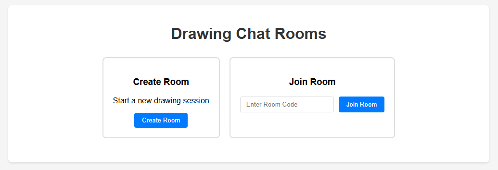
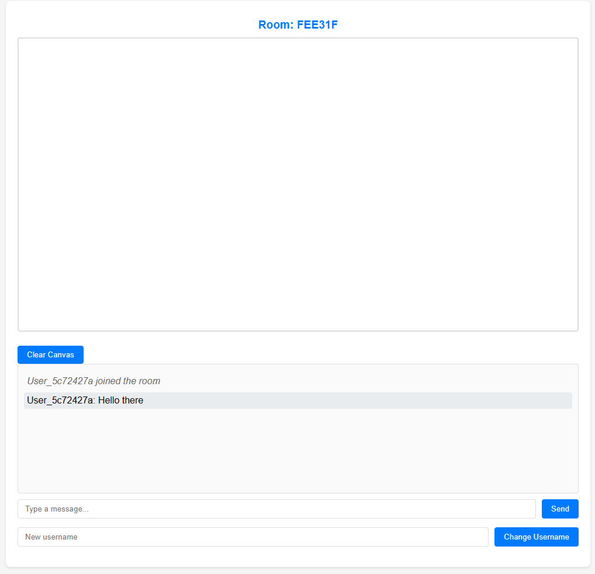

# Draw and talk

This project allows for a user to create a website for collaboration by multiple users

All you have to do is start up a DigitalOcean Droplet and pull this repo in. Once you have done that, enter the folder and build it with Docker Compose. Once Docker Compose is running, going to the IP that belong to the droplet should give you the following.

It is at this point that you can select if you want to select a room or create a new one. Selecting to create a new one will make a session that looks like the one below.

If you would rather join someone else, use the room name at the top to join your friends.
